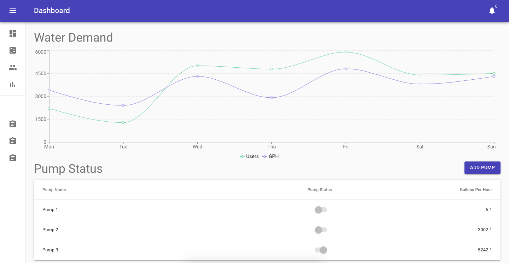

# Exploring our services and user journeys 

Let’s take a quick tour of our application. 

You can tour the application by examining the content of the `docker-compose.yml` file. This application was originally developed for a Distributed Tracing workshop to showcase how Datadog APM integrates with multiple programming languages and technologies. 

Today we'll focus on 3 containers:
 
* The agent: it is necessary to collect metrics and traces from the other containers
* Frontend: a Python Flask application that receives calls and routes them to different backend services, the code lives in the `./frontend` folder. It also serves a React Single Page Application as a static file built from the `./single-page-frontend` folder.
* Pumps: another Flask application that receives calls from the frontend related to the water pumps. The code lives in the `./pumps-api` folder.

Both Flask applications are automatically instrumented by Datadog APM (see the `command` statements in `docker-compose.yaml`) which will generate metrics in the `trace.flask.` namespace. Hint: remember this for later.

This Katacoda environment allows you to modify the Python code and see the results. Simply browse the code in the editor and edit it then type CTRL+c in the terminal to quit Docker Compose and start it again with the `docker-compose up` command.

So let's think about reliability of this system. To start tracking SLIs we'll consider what our user journey should be. Go to the water pump web app and explore! https://2886795280-5000-ollie01.environments.katacoda.com/

One of the main functions on this page is the ability to add a new water pump. Can you add one? 

Go to the app and add new pumps! https://2886795280-5000-ollie01.environments.katacoda.com/

Can you identify SLIs for our user journey? 

