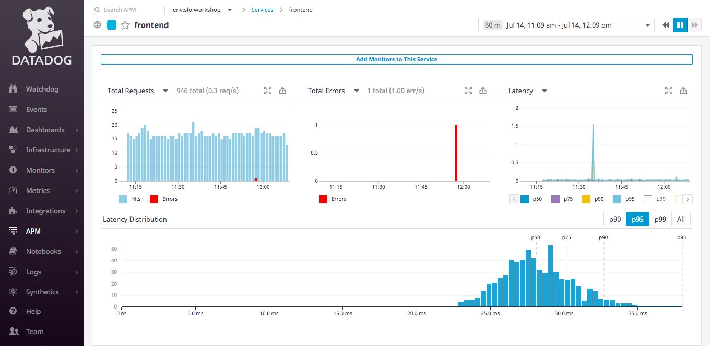

# Exploring available metrics for SLIs 

Let’s explore what we can have available in Datadog. There are a few ways to do this. You can explore and search for metrics in the notebooks, across your monitors, and dashboards or across your services instrumented with APM like what we will be doing here. To dig into the services, resources, and the available metrics, let’s search our traces: https://app.datadoghq.com/apm/search 

We care about users being able to add pumps so let’s scope down to the `add_pump` resource by using the facets on the left side of the screen. This is core to our `frontend` service. 

*[Optional] If you'd like, you can click on any of these traces to show the transaction:*

You can see that a `POST` to 
`/add_pump` in the frontend service (frontend/api.py) calls a `POST` request to `/devices` in the pumps-service (pumps-api/pumps.py).

Let’s go to the frontend service dashboard. In the side nav click: **APM -> Services -> Frontend**

We haven’t purposefully introduced any errors *yet*, since we just got started. So the services dashboard may look something like this: 

But eventually will look something like this: 

Remember before we mentioned that the APM metrics were instrumented for the `trace.flask.` namespace. So the metrics we'll focus on are called `trace.flask.request.hits` and `trace.flask.request.errors`. Let’s use this to create our first SLI. 
