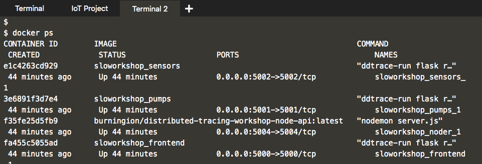
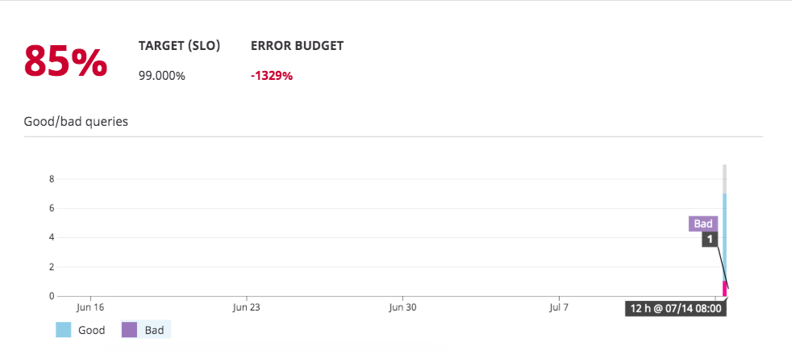

# Modeling Failure in Our Systems

For our final challenge, let's start introducing errors by killing containers! Let’s see what happens to our error budget. 
 
In the real world, there’s a lot of traffic and there’s definitely going to be some errors. 
For now we are dealing with our small water pump app. 

Before we start killing containers, maybe check back to the app and add more pumps! https://2886795280-5000-ollie01.environments.katacoda.com/
 
Open a new terminal window by clicking the + sign within Katacoda. There is an option called Open New Terminal.
 
Try removing a running service with a:
$ docker ps
$ docker kill <containerid>
 
Kill the container running the pumps: 

 
Go back to your SLO details page. What happens? 

 
Let’s zoom into that bar graph for more detail: 

Remember, if you kill the iot-frontend, the rest of the downstream services will die.
If you break something, switch back to your terminal running docker-compose. Remember, you can CTRL+C, followed by pressing up to rerun the last command and bring back up the entire suite of services.
